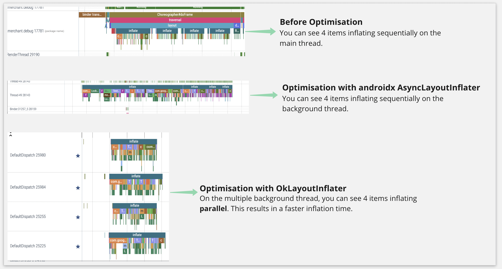

## OkLayoutInflater

AndroidX [AsyncLayoutInflater](https://developer.android.com/reference/androidx/asynclayoutinflater/view/AsyncLayoutInflater) has some limitations. Introducing OkLayoutInflater with Coroutines to address these limitations. Below are the limitations

1. A single thread to handle all inflation tasks.
2. Cancellation of ongoing inflation is not possible because inflation work is not lifecycle aware.
3. LayoutInflater.Factory2 is not supported.
4. The default size limit of the cache queue is [10](https://android.googlesource.com/platform/frameworks/support/+/89f7eba/v4/java/android/support/v4/view/AsyncLayoutInflater.java#166). If it exceeds 10, it will cause the main thread to wait.

Check out this [blog post](https://medium.com/okcredit/oklayoutinflater-3c5cd93c6ebc) for more details about each limitation and how OkLayoutInflator fixed it.

### Usage

**Example in a Activity**
```kotlin
private lateinit var binding: ActivityMainBinding
private val okLayoutInflater by lazy { OkLayoutInflater(this) }

override fun onCreate(savedInstanceState: Bundle?) {
    super.onCreate(savedInstanceState)
    setContentView(R.layout.layout_loading_view)
    okLayoutInflater.inflate(R.layout.activity_main, null) { view ->
        binding = ActivityMainBinding.bind(view)
    }
}
```

**Example in a Fragment**

```kotlin
private val okLayoutInflater by lazy { OkLayoutInflater(this) }

override fun onCreateView(inflater: LayoutInflater, container: ViewGroup?, savedInstanceState: Bundle?): View? {
    val loadingView = inflater.inflate(R.layout.loader_view, container, false)
    okLayoutInflater.inflate(contentLayoutId, container) { inflatedView ->
        (loadingView as? ViewGroup)?.addView(inflatedView)
    }
    return loadingView
}
```

**Example of usage in a View**

```kotlin
private val okLayoutInflater by lazy { OkLayoutInflater(this) }

override fun onAttachedToWindow() {
    super.onAttachedToWindow()
    okLayoutInflater.inflate(R.layout.transaction_view, this) { inflatedView ->
        removeAllViews()
        addView(inflatedView, LayoutParams.MATCH_PARENT)
    }
}
```

### Gradle Setup

```gradle
repositories {
    maven { url 'https://jitpack.io' }
}

dependencies {
    implementation 'com.github.okcredit:OkLayoutInflater:1.0.2'
}
```

### Performance improvement of OkLayoutInflator
Inflating XML is expensive due to loading the layout into memory and parsing views through reflection. It is known that when the main thread performs some time-consuming operations, it may cause the app to freeze. OkLayoutInflator allows you to offload those tasks to background threads with maximum parallelism. In Recyclerview, this is particularly useful. A systrace slice showing an optimization for the recycler view item can be seen below.





### License

    Copyright 2022 OkCredit.

    Licensed under the Apache License, Version 2.0 (the "License");
    you may not use this file except in compliance with the License.
    You may obtain a copy of the License at

       http://www.apache.org/licenses/LICENSE-2.0

    Unless required by applicable law or agreed to in writing, software
    distributed under the License is distributed on an "AS IS" BASIS,
    WITHOUT WARRANTIES OR CONDITIONS OF ANY KIND, either express or implied.
    See the License for the specific language governing permissions and
    limitations under the License.
